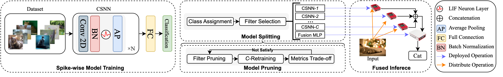

# EC-SNN
This is the repository of our article submitted in IJCAI 2024 "EC-SNN: Splitting Deep Spiking Neural Networks on Edge Devices" and of several follow-up studies.

## Overview

<p align="center">

</p>

## Requirements

```
torch==2.0.1
torchvision==0.15.2
librosa==0.10.1
spikingjelly==0.0.0.0.14
numpy==1.23.5
pandas==1.5.3
scikit-learn==1.2.1
opencv-python==4.8.1.78
```

## How to run

Examples of running commands for different purposes are listed below, please modify corresponding parts to implement your expected task. (All running commands in shell scripts will be attached to Github Pages later.)

### model training

```
python ecsnn.py -train -arch=vgg9 -act=snn -device=cuda -data_dir=. -dataset=cifar10 -b=128
```

### model pruning for one edge device with all classes selected

make sure the class tokens are integers starting from 0.

```
python ecsnn.py -prune -arch=vgg9 -act=snn -data_dir=. -dataset=cifar10 -b=128 -split_dir=./splitted/ -device=cuda -apoz=95 -c 0 1 2 3 4 5 6 7 8 9
```

### energy consumption

```
python ecsnn.py -split -energy -arch=vgg9 -act=snn -device=cuda -split_dir=./splitted/ -data_dir=. -dataset=cifar10 -b=128
```

### latency

make sure `./infer_data/` contains the specific frame you want before making inference

```
python ecsnn.py -split -infer -arch=vgg9 -act=snn -device=cpu -split_dir=./splitted/ -dataset=cifar10
```

_For more details about each arguments, try reaching our Github pages later._

### cifarnet quick start

Implement the following commands step by step to get the quick results. We provide this part for a quick access for the whole workflow of EC-SNN.

```
# training
python ecsnn.py -arch=cifarnet -act=snn -device=cuda -train 
python ecsnn.py -arch=cifarnet -act=ann -device=cuda -train 
python ecsnn.py -arch=cifarnet -act=snn -prune -b=128 -split_dir=./splitted/ -device=cuda -apoz=95 -c 0 1 2 3 4 5 6 7 8 9
python ecsnn.py -arch=cifarnet -act=ann -prune -b=128 -split_dir=./splitted/ -device=cuda -apoz=56 -c 0 1 2 3 4 5 6 7 8 9
python ecsnn.py -arch=cifarnet -act=snn -fusion -split_dir=./splitted/ -device=cuda -b=128
python ecsnn.py -arch=cifarnet -act=ann -fusion -split_dir=./splitted/ -device=cuda -b=128

# latency
python ecsnn.py -arch=cifarnet -act=snn -device=cuda -infer 
python ecsnn.py -arch=cifarnet -act=ann -device=cuda -infer 
python ecsnn.py -arch=cifarnet -act=snn -device=cuda -infer -split -split_dir=./splitted/
python ecsnn.py -arch=cifarnet -act=ann -device=cuda -infer -split -split_dir=./splitted/

# energy consumption
python ecsnn.py -arch=cifarnet -act=snn -device=cuda -energy -b=128
python ecsnn.py -arch=cifarnet -act=ann -device=cuda -energy -b=128
python ecsnn.py -arch=cifarnet -act=snn -device=cuda -energy -split -split_dir=./splitted/ -b=128
python ecsnn.py -arch=cifarnet -act=ann -device=cuda -energy -split -split_dir=./splitted/ -b=128
```

## Datasets

You can download experiment data and put them into the data folder. All data are available in the links below:

 - [CIFAR10](https://www.cs.toronto.edu/~kriz/cifar.html)
 - [Caltech 101](https://data.caltech.edu/records/mzrjq-6wc02)
 - [CIFAR10-DVS](https://figshare.com/articles/dataset/CIFAR10-DVS_New/4724671)
 - [N-Caltech101](https://www.garrickorchard.com/datasets/n-caltech101) (Recommend One Drive)
 - [GTZAN](https://www.kaggle.com/datasets/andradaolteanu/gtzan-dataset-music-genre-classification)
 - [UrbanSound8K](https://www.kaggle.com/datasets/chrisfilo/urbansound8k)

## Cite

Please cite the following paper if you find our work contributes to yours in any way:

```
@inproceedings{,
  title={EC-SNN: Splitting Deep Spiking Neural Networks on Edge Devices},
  author={},
  booktitle={},
  year={2024}
}
```

## TODO List

- [ ] make over shell commands to Github pages
- [x] appendix for all results
- [ ] beautify `ecsnn.py` 
